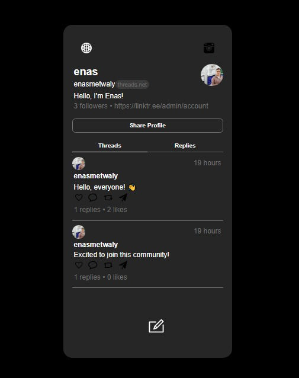

# Threads App

Welcome to Threads App! This project is a Threads application bootstrapped with Create React App. It empowers users to engage in threaded discussions on various topics.

## Available Scripts

In the project directory, you can run:

- `npm start`: Runs the app in development mode. Open [http://localhost:3000](http://localhost:3000) to view it in your browser.
- `npm test`: Launches the test runner in interactive watch mode.
- `npm run build`: Builds the app for production to the build folder.

## Project Snapshot

Feel free to explore the Threads App and dive into meaningful discussions!
